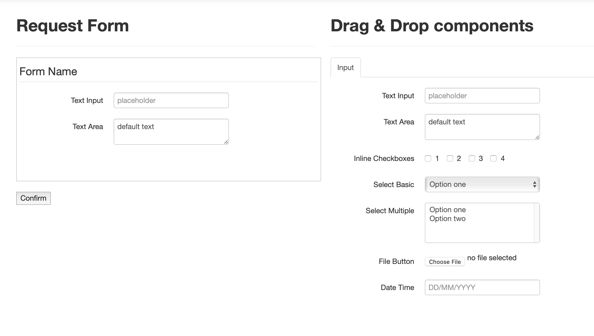
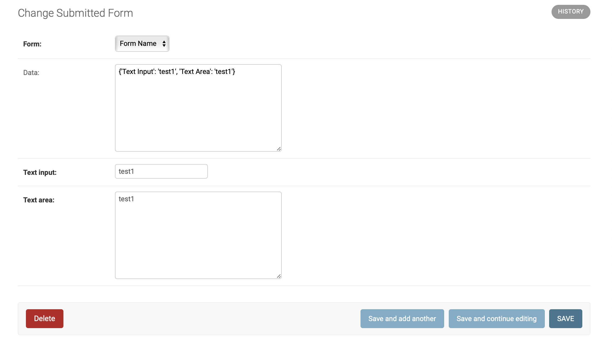

## **django-form-builders**

Django package for building and populating custom forms. </br>
Django form builder is made for creating and populating forms which we can't define in models beforehand.
We use bootstrap form builder by [Adam Moore!](https://github.com/minikomi/Bootstrap-Form-Builder) and TextField which is for our form representation JSON. We defined our Class
for JSON in TextField format so you can use it with sqlite3 also. Bellow you can see step by step installation and also
a sample project.

### **Installable App**

This app can be installed and used in your django project by:

```
$ pip install realpython-django-receipts
```

Edit your settings.py file to include 'form_builders' in the INSTALLED_APPS listing.

``` python
url_patterns = [
    ...

    path('form-builders/', include('form_builders.urls')),
]
```

Finally, add the models to your database:

```
$ ./manage.py makemigrations receipts
```

### **Usage**

This app has 3 main functions.

* Create Forms
* Get details about the forms
* Populate created forms

So lets go step by step.

**Creating forms**
Navigate to http://localhost:8000/form_builders/create

Move needed fields from right to left, give name to your form and press create button.



**Getting details about the form**

After creating a form in the previous step, now we can get list of all forms then choose one and get fields of it.

`GET http://localhost:8000/form_builders/get-forms-list`

This one returns all created forms. For getting details of one of the listed forms make a get request as below.

`GET http://localhost:8000/form_builders/get-form-data/:pk`

There you can see all fields and parameters for them.

**Populating created forms**

`POST http://localhost:8000/form_builders/post-form`

Posted fields format should be ``field_name: data``
Ex.

    {
      "form": 1,
      "data": {
        "Text Input": "test value",
         "Text Area": "test value"
       }
    }

** Result **

Then you can finally go to admin and see submitted forms.


